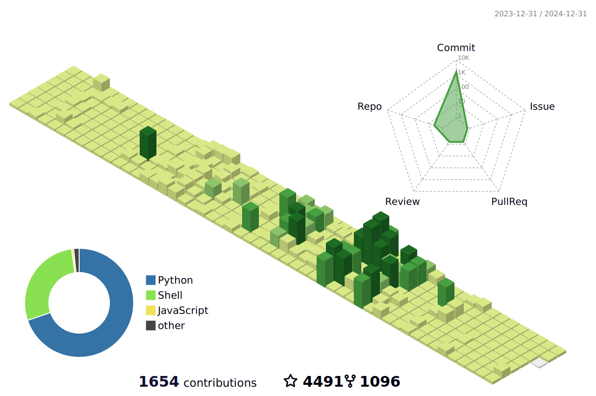

<!--   my-icons -->

    
    
    
    
    
       

<!--   my-header-img -->

<!--  -->

<!--   my-ticker --> 

  🎓 Currently a cybersecurity student.
   
  💻 I love to learn new technologies and frameworks.
   
  🧑‍💼 I’m currently a freelancer & working as a 3 js developer
   

<h3 align="center">Connect with me:</h3>
<!-- social handles -->

 
<!-- youtube -->
  <!--  -->
  <!-- twitter -->
   
  <!-- gmail -->
  
  <!-- linkedin -->
   

<!--  -->
<!--  -->

<!--   my-kaggle     
### My achievements on [kaggle](https://www.kaggle.com/andrej0marinchenko):

-->
<!--   my-skils -->
<h2 align="center">🔥 Languages-Frameworks-Tools 🔥</h2>
 

  <a href="https://skillicons.dev">
      <!-- first row -->
      <picture>
          <source media="(prefers-color-scheme: dark)" srcset="https://skillicons.dev/icons?i=nextjs%2Creact%2Cgit%2Chtml%2Ccss%2Cjavascript%2Cts%2Ctailwind%2Cfigma%2Cthreejs&theme=dark" />
<source media="(prefers-color-scheme: light), (prefers-color-scheme: no-preference)" srcset="https://skillicons.dev/icons?i=nextjs%2Creact%2Cgit%2Chtml%2Ccss%2Cjavascript%2Cts%2Ctailwind%2Cfigma%2Cthreejs&theme=light" />
          
        </picture>
           
          <!-- second row -->
          <picture>
            <source media="(prefers-color-scheme: dark)" srcset="https://skillicons.dev/icons?i=nodejs%2Cexpress%2Cmongodb%2Cmysql%2Cpostgres%2Credux%2Cprisma%2Cfirebase%2Csupabase&theme=dark" />
            <source media="(prefers-color-scheme: light), (prefers-color-scheme: no-preference)" srcset="https://skillicons.dev/icons?i=nodejs%2Cexpress%2Cmongodb%2Cmysql%2Cpostgres%2Credux%2Cprisma%2Cfirebase%2Csupabase&theme=light" />
            
        </picture>

  </a>

 

<!-- deployment -->
<h3 align="center">Deployment</h3>

  <a href="https://skillicons.dev">
      <picture>
          <source media="(prefers-color-scheme: dark)" srcset='https://skillicons.dev/icons?i=planetscale%2Cvercel%2Cnetlify&theme=dark' />
          <source media="(prefers-color-scheme: light), (prefers-color-scheme: no-preference)" srcset='https://skillicons.dev/icons?i=planetscale%2Cvercel%2Cnetlify&theme=light' />
          
        </picture>
  </a>
 

<!--   GitHub stats graph -->
### 📈 GitHub Activity Graph:

<!--   green snake -->
<!--  -->
<!--   stats + languages -->

<!-- dark snake -->

  
  
  

 
  <!-- contribution graph -->
  <a href="https://github.com/Ashutosh00710/github-readme-activity-graph" title="Go to Source">
    <picture>
      <source media="(prefers-color-scheme: dark)" srcset="https://github-readme-activity-graph.vercel.app/graph?username=Minhal128&theme=react-dark" />
      <source media="(prefers-color-scheme: light), (prefers-color-scheme: no-preference)" srcset="https://github-readme-activity-graph.vercel.app/graph?username=Minhal128&bg_color=ffffff&color=708090&line=24292e&point=24292e&area=true&hide_border=true" />
      
    </picture>
  </a>

<!--   profile-green-animate -->

<!--   grid-snake  -->

<!--   skyline 

-->

<!--  TOP codersrank для обновления картинки нужно обновить профиль на странице https://profile.codersrank.io/user/bepb-->

<!-- </img> -->
<!--  2d history skills для обновления картинки нужно обновить профиль на странице https://profile.codersrank.io/user/bepb-->
<!-- </img> -->

<!-- **📫 How to Reach me:**

 -->
<!--

Trophy: Github Profile Trophy

 

<h2 align="center">👨‍💻 Repositories 👨‍💻</h2>
 
<!-- first row -->

  <!-- repo 1 -->
  <a align="right" href=" https://github.com/Minhal128/Portfolio-ThreeJS.git" title="ThreeJS - Portfolio" target="_blank">
    <picture>
      <source media="(prefers-color-scheme: dark)" srcset="https://github-readme-stats.vercel.app/api/pin/?username=Minhal128&repo=Portfolio-ThreeJS&theme=react&border_color=61dafb&border_radius=10.0" />
      <source media="(prefers-color-scheme: light), (prefers-color-scheme: no-preference)" srcset="https://github-readme-stats.vercel.app/api/pin/?username=Minhal128&repo=Portfolio-ThreeJS&theme=graywhite&border_radius=10.0" />
      
    </picture>
  </a>

  <!-- repo 2 -->
  <a align="left" href="https://github.com/Minhal128/SPYSEE.git" title="3D Portfolio">
    <picture>
      <source media="(prefers-color-scheme: dark)" srcset="https://github-readme-stats.vercel.app/api/pin/?username=Minhal128&repo=SPYSEE&theme=react&border_color=61dafb&border_radius=10" />
      <source media="(prefers-color-scheme: light), (prefers-color-scheme: no-preference)" srcset="https://github-readme-stats.vercel.app/api/pin/?username=Minhal128&repo=SPYSEE&theme=graywhite&border_radius=10" />
      
    </picture>
  </a>

      
<!-- second row -->

  <!-- repo 3 -->
  <a align="left" href="https://github.com/Minhal128/ImagiMingle.git" title="MERN Admin Dashboard">
    <picture>
      <source media="(prefers-color-scheme: dark)" srcset="https://github-readme-stats.vercel.app/api/pin/?username=Minhal128&repo=ImagiMingle&theme=react&border_color=61dafb&border_radius=10" />
      <source media="(prefers-color-scheme: light), (prefers-color-scheme: no-preference)" srcset="https://github-readme-stats.vercel.app/api/pin/?username=Minhal128&repo=ImagiMingle&theme=graywhite&border_radius=10" />
      
    </picture>
  </a>

  <!-- repo 4 -->
  <a align="right" href="https://github.com/Minhal128/3D-ClientPortfolio.git" title="Brainwave SaaS Landing Page">
    <picture>
      <source media="(prefers-color-scheme: dark)" srcset="https://github-readme-stats.vercel.app/api/pin/?username=Minhal128&repo=3D-ClientPortfolio&theme=react&border_color=61dafb&border_radius=10" />
      <source media="(prefers-color-scheme: light), (prefers-color-scheme: no-preference)" srcset="https://github-readme-stats.vercel.app/api/pin/?username=Minhal128&repo=3D-ClientPortfolio&theme=graywhite&border_radius=10" />
      
    </picture>
  </a>

<!-- spaces -->

      

<!-- show more repos -->
<h4 align="center">
  <a href="https://github.com/Minhal128?tab=repositories" title="Show Repositories">🔎 Show More 🔍</a>
</h4>

   <!--machine-learning-->

   
 

[MIT](LICENSE)

---
  *If you liked my profile, you can Star ⭐ the repo and if you want to use this template you can Fork it and can use.* 
  

  

 

---
Would you ike to meet me?

If you want to contribute to any of my repositories, feel free to submit PRs, issues and email me. Pick a slot if you'd like to meet me and chat about proposals and ideas - but make sure to describe the agenda

